# Releases

This project releases with a review-gated, label-driven workflow: ordinary
pull requests carry a SemVer signal and (usually) a changelog fragment, a
generated pull request batches them into a version, and merging that pull
request is the human approval that triggers publication. Nothing is
published without a merge to `main`.

## Release model

| Concept | What it is | Where it lives |
| --- | --- | --- |
| `release/*` label | The SemVer signal for one pull request: major, minor, patch, or skip. | Applied to the pull request in GitHub. |
| Changelog fragment | The user-facing changelog text for one change. | `.changes/unreleased/*.yaml`, added with `changie new`. |
| Release pull request (`release/next` -> `main`) | The human approval gate. Merging it is what triggers tagging and publication. | Opened/updated by `prepare-release.yml`, labeled `autorelease: pending`. |
| `vX.Y.Z` tag | The released version. Immutable once created; never moved or deleted. | Created by `release.yml`'s `tag` job on the merge commit. |
| GoReleaser | Builds the release artifacts (archives, checksums, SBOMs) and drafts the GitHub Release using the batched Changie section as its notes. | `.goreleaser.yml`, run by `release.yml`'s `publish` job. |

## Choosing a release label

Every pull request that targets `main` needs exactly one label:

- `release/major` -- a breaking change; the next release increments major.
- `release/minor` -- a backward-compatible feature; the next release
  increments minor.
- `release/patch` -- a backward-compatible fix; the next release increments
  patch.
- `release/skip` -- no user-facing release or version impact.

`release/skip` is the right choice for CI-only changes, test-only changes,
formatting-only changes, and documentation-only changes -- unless the change
is itself user-facing (for example, a change to a published table's
documented behavior). `release/skip` pull requests must not carry a
changelog fragment; `releasectl validate-pr` rejects one if it finds it.

The one exception to "exactly one label" is the generated release pull
request itself: `prepare-release.yml` opens it from the `release/next`
branch with the `autorelease: pending` label, and `releasectl validate-pr`
exempts it entirely from label and fragment checks (see
`isGeneratedReleasePR` in `internal/release/validate.go`). That exemption
only applies when the head repository, head branch, and label all match
exactly -- a fork cannot spoof it by copying just one of the three.

## Adding a changelog fragment

Add a fragment for any pull request that isn't `release/skip`, using the
pinned Changie version (never a global install):

```sh
go run github.com/miniscruff/changie@v1.25.2 new
```

This prompts for a kind and a body and writes a file under
`.changes/unreleased/`. Non-interactively:

```sh
go run github.com/miniscruff/changie@v1.25.2 new \
  --kind Added --body "Add the youtrack_sprint table." --interactive=false
```

One example fragment per kind, in the order Changie renders them:

```yaml
kind: Added
body: Add the youtrack_sprint table.
```

```yaml
kind: Changed
body: Increase the default query page size from 50 to 100.
```

```yaml
kind: Deprecated
body: Deprecate the legacy_id column on youtrack_issue; use id_readable instead.
```

```yaml
kind: Removed
body: Remove the unused --legacy-auth flag.
```

```yaml
kind: Fixed
body: Fix a panic when base_url has no scheme.
```

```yaml
kind: Security
body: Reject YouTrack Server versions with a known-vulnerable Hub relay.
```

```yaml
kind: Dependencies
body: Upgrade klauspost/compress to 1.18.7 to resolve GO-2026-5841 in the transitive dependency graph.
```

A fragment's body is scanned for obvious credential shapes (GitHub tokens,
YouTrack permanent tokens) and rejected if one is found -- never paste a
real token into a fragment body.

## Dependabot pull requests

Dependabot pull requests are ordinary pull requests as far as
`pr-release-metadata.yml` is concerned: they still need exactly one
`release/*` label before they can merge. Dependabot itself does not apply
one, so a maintainer must add it manually:

- For a user-facing dependency bump (one that changes runtime behavior a
  consumer of the plugin could observe), apply the appropriate
  `release/major`, `release/minor`, or `release/patch` label and add a
  `Dependencies` changelog fragment.
- For a bump with no user-facing effect (a dev-only tool, a test
  dependency, a transitive bump that changes nothing observable), apply
  `release/skip`.

## How the next version is computed

`prepare-release.yml` collects every ordinary pull request merged to `main`
since the latest stable `vX.Y.Z` tag (generated release pull requests are
never counted) and asks `releasectl next-version` for the next version. The
highest release signal among those pull requests wins, independent of merge
order:

`major > minor > patch > skip`

| Pull requests merged | Result |
| --- | --- |
| patch + patch | patch |
| minor + patch | minor |
| major + anything | major |
| only skip | no release can be prepared |

Standard SemVer applies both before and after `1.0.0` -- there is no special
pre-1.0 rule that treats a minor bump as breaking:

| Previous | Bump | Next |
| --- | --- | --- |
| `v0.1.0` | major | `v1.0.0` |
| `v0.1.0` | minor | `v0.2.0` |
| `v0.1.0` | patch | `v0.1.1` |

When there is no previous tag at all (bootstrap), the next version is always
`v0.1.0`, regardless of which release labels are present on the releasable
pull requests. `next-version`'s JSON output still reports `"bump":"minor"`
in that case, but that's the fixed bootstrap value, not a reflection of any
pull request's label -- don't read it as "a minor-labeled pull request
triggered this release."

You can run the same computation `prepare-release.yml` uses locally:

```sh
echo '{"previous_tag":"","prs":[{"number":1,"labels":["release/minor"],"head_branch":"feat/x","head_repo":"RafPe/steampipe-plugin-youtrack"}]}' \
  | go run ./cmd/releasectl next-version --input - --trusted-repo RafPe/steampipe-plugin-youtrack
# {"release":true,"version":"v0.1.0","previous":"v0.0.0","bump":"minor"}
```

## Maintainer guide

### Release flow

```mermaid
stateDiagram-v2
    [*] --> Prepared: prepare-release.yml (workflow_dispatch)
    Prepared --> ReleasePR: open/update release/next -> main PR, labeled autorelease pending
    ReleasePR --> Merged: maintainer reviews checklist, merges
    Merged --> Verify: release.yml verify job
    Verify --> Check: make check at the merge commit
    Check --> E2E: e2e.yml (reusable, same merge commit)
    E2E --> Tag: annotated vX.Y.Z tag created
    Tag --> Artifacts: goreleaser release --clean (draft) + attestation
    Artifacts --> Published: assets verified against dist/artifacts.json, draft flipped to false
    Published --> [*]

    Verify --> Recovery: workflow_dispatch with tag input
    Recovery --> Tag: tag already exists; verified against merge SHA
```



Recovery mode (the bottom path) only applies once a `vX.Y.Z` tag already
exists -- see [Recovery runbook](#recovery-runbook) below.

### E2E is self-contained

Both `release.yml`'s `e2e` job (gating every release before the tag is
created) and `e2e.yml`'s own weekly `schedule` trigger (`17 3 * * 1`, every
Monday) provision their own throwaway YouTrack instance and mint their own
permanent token at runtime (`tests/e2e/provision.sh`; see
[E2E testing](e2e.md)). There is no stored credential and no GitHub
Environment to configure -- nothing for a maintainer to set up before E2E
can run, and no credential-protection trade-off to make. The same
self-contained job also runs on any pull request labeled `e2e` -- see
[Running E2E on a pull request](e2e.md#running-e2e-on-a-pull-request) --
which is safe even from a fork for the same reason: no stored credential
for it to touch.

### Running prepare-release

`prepare-release.yml` is `workflow_dispatch`-only, with no inputs:

```sh
gh workflow run prepare-release.yml --repo RafPe/steampipe-plugin-youtrack --ref main
```

It is safe to run at any time. If there is nothing releasable (every merged
pull request since the last tag is `release/skip`, or there are no merged
pull requests at all), it computes `release: false` and exits without
opening or touching any pull request.

### Bootstrapping the first release

On the very first `prepare-release.yml` run, there is no previous stable
tag, so `next-version` collects *every* pull request ever merged to `main`
since the repository's start, not just recent ones. Every one of those
pull requests needs exactly one `release/*` label -- `next-version` errors
out the whole run if it finds a merged pull request with zero or more than
one (see `NextVersion` in `internal/release/nextversion.go`). Labels can be
added to a pull request after it is closed, so this is fixable retroactively,
but it does mean a maintainer must label the entire merge history before the
first `prepare-release.yml` run can succeed -- including pull request #1,
which is easy to forget precisely because it predates the convention.

### Reviewing the release pull request

The generated pull request's body includes:

- The proposed version and the previous tag (or "bootstrap release" if
  there is none).
- Every pull request that contributed to the release, with its release
  label.
- The batched changelog excerpt for this version.
- A maintainer checklist:
  - [ ] Backward compatibility reviewed
  - [ ] Publication approved -- merging this pull request triggers
    `release.yml`, which tags and publishes

Because the pull request is opened with `GITHUB_TOKEN`, GitHub does not
fire `pull_request` `labeled` or `closed` events for anything
`prepare-release.yml` itself does to it, and its `opened`/`synchronize`
activity queues CI in an **approval-required** state (look for "Approve
and run workflows" in the merge box). That's informational only, not a
merge blocker: `release.yml`'s own `verify` -> `check` job independently
re-runs `make check` (and E2E) at the merge commit before anything is
tagged or published, so the release pull request's own CI status is not
load-bearing for release safety.

Merging the release pull request (a real human action, not
`GITHUB_TOKEN`) is what starts `release.yml`.

## Local commands

- `make release-check` -- runs `goreleaser check` against `.goreleaser.yml`
  and `make changelog-check`. Fast; also runs on every pull request as
  ci.yml's `release-config` job.
- `make release-snapshot` -- a full multi-arch GoReleaser snapshot build
  plus the archive/checksum/SBOM contract check
  (`scripts/release-snapshot-check.sh`). Slow (real cross-compiles and SBOM
  generation); runs on every pull request as ci.yml's `release-snapshot`
  job, and is a documented local target for the same check.
- `make release-dry-run` -- runs `release-snapshot`, then prints how
  `next-version` works (its stdin contract and the same example command
  shown above) without creating anything.
- `make changelog-check` -- runs `scripts/changelog-check.sh`: checks the
  rendered Changie output against a golden fixture for template/config
  drift, then validates every fragment in `.changes/unreleased` with
  `releasectl validate-fragments`.

A local dry-run walkthrough:

```sh
make release-dry-run
```

This builds real archives for all four platforms into `dist/`, generates
their SBOMs, and verifies the archive/checksum/SBOM contract -- without
creating a tag, a pull request, or a GitHub Release, and without needing
any credentials.

### The releasectl exit code caveat

`releasectl` documents three exit codes: `0` success, `1` a validation
failure (bad labels, missing fragment, bad SemVer), `2` a usage or I/O
error (bad flags, malformed JSON). Whether that distinction is visible by
exit code alone depends on how a given workflow invokes it:

- `pr-release-metadata.yml` builds `releasectl` once (from the trusted
  `base.sha` checkout) and runs the prebuilt binary directly, so its exit
  code is preserved exactly: `2` really is distinguishable from `1` there,
  and the workflow's `if [ "$status" -eq 2 ]` branch is reachable.
- `prepare-release.yml`'s `next-version` call still goes through
  `go run ./cmd/releasectl next-version ...`. `go run` does not preserve
  the wrapped program's exit code past 1: a `releasectl` exit 2 surfaces to
  the calling shell step as `go run` exiting with status 1, not 2, even
  though `go run`'s own stderr still prints `exit status 2` and
  `releasectl`'s own error message is preserved. This does not affect
  correctness (both cases correctly fail the job); it only means "usage
  error" versus "validation error" has to be read from the log text, not
  the exit code, if you're triaging a failed `prepare-release.yml` run.

## Recovery runbook

Never move, delete, or overwrite a published tag or GitHub Release. Every
scenario below either fixes and reruns something that has not published
yet, or uses the built-in recovery path for something that has.

- **Rerun of `prepare-release.yml` before the release pull request
  merges.** Idempotent: it force-pushes `release/next` from `main`'s
  current tip and recomputes the version and changelog batch from scratch
  each run, then upserts (edits or creates) the one open release pull
  request. Safe to run repeatedly.
- **More ordinary pull requests merge while the release pull request is
  still open.** Rerun `prepare-release.yml`. It recomputes the version and
  changelog against the full set of pull requests merged since the last
  tag (including the new ones) and force-pushes the refreshed content to
  `release/next`, updating the same pull request in place.
- **The release pull request becomes stale** (for any reason -- the same
  fix applies). Rerun `prepare-release.yml`; there is no manual pull
  request editing step.
- **E2E fails before the tag is created.** Nothing is published: the `tag`
  job needs both `verify` and `e2e` to succeed. Fix the underlying issue,
  then use GitHub's "Re-run failed jobs" (or "Re-run all jobs") on the
  same `release.yml` run from the Actions UI -- it replays against the
  same merged pull request event, and since no tag exists yet, `verify`
  proceeds through the normal (non-recovery) path.
- **The tag exists but artifact build or publication failed.** Use
  `release.yml`'s `workflow_dispatch` recovery mode with the existing tag:

  ```sh
  gh workflow run release.yml --repo RafPe/steampipe-plugin-youtrack --ref main -f tag=vX.Y.Z
  ```

  `verify` confirms the tag points at the expected merge commit, `tag`
  leaves the existing tag alone, and `publish` reuses an existing draft
  release (or refuses to run if that release was already published, to
  avoid double-publishing).
- **A wrong artifact was published for an immutable tag.** Do not replace
  it. Ship a new patch release with the fix; the bad tag and its release
  stay as-is.
- **Never delete or move a published tag or GitHub Release**, even to
  "fix" a mistake -- ship a new patch instead (see above).
- **A maintainer accidentally creates a conflicting manual tag** (a
  `vX.Y.Z` tag that was never produced by `release.yml`). If `release.yml`
  later tries to use that version and finds the tag already exists outside
  recovery mode, `verify`'s tag-state check fails loud
  (`tag vX.Y.Z already exists but this is not a recovery run`) rather than
  silently reusing or overwriting it. If the manual tag was never
  associated with a published GitHub Release, a maintainer with push
  access can delete just that tag (`gh api -X DELETE
  repos/RafPe/steampipe-plugin-youtrack/git/refs/tags/vX.Y.Z`) and rerun
  `prepare-release.yml`. If it already has a published release attached,
  treat it like any other published tag: leave it and ship a new patch.
- **GitHub API throttling or an outage.** Every write in these workflows
  is either read-only (the `verify`/`check` jobs) or already idempotent
  (`release/next` is force-pushed and the release pull request is
  upserted; the tag step checks for an existing tag before creating one;
  `publish` checks for an existing non-draft release before running
  GoReleaser). There is no step that performs a non-idempotent side effect
  on retry, so the safe response to a transient API failure is simply to
  rerun the failed job (or the whole workflow) once the outage clears.

## Verifying release artifacts

Every release asset can be verified independently of trusting the GitHub
Release page:

```sh
gh release download vX.Y.Z --repo RafPe/steampipe-plugin-youtrack --dir dist
cd dist

# Checksums
sha256sum -c checksums.txt        # or: shasum -a 256 -c checksums.txt

# Build provenance attestation (gh attestation is a built-in gh CLI
# command on a recent gh, not a separate extension to install)
gh attestation verify steampipe-plugin-youtrack_linux_amd64.gz \
  --repo RafPe/steampipe-plugin-youtrack

# SBOM inspection (SPDX JSON, one per archive)
jq '.packages[] | {name, versionInfo}' \
  steampipe-plugin-youtrack_linux_amd64.gz.spdx.json
```

Each archive (`steampipe-plugin-youtrack_{os}_{arch}.gz`) is a bare gzip
stream of the single `steampipe-plugin-youtrack.plugin` binary — not a
tar.gz — as the Steampipe Hub's build pipeline requires; extract it with
`gzip -dc <archive> > steampipe-plugin-youtrack.plugin`.

## Steampipe Hub onboarding handoff

The release machinery in this repository satisfies the Steampipe Hub's
naming and packaging contract (binary name, archive name, per-platform
matrix, checksums, SBOMs). What Turbot needs to complete Hub onboarding, on
top of that:

- The repository URL (`https://github.com/RafPe/steampipe-plugin-youtrack`).
- At least one published (non-draft) release tag, e.g. `v0.1.0`.
- The repository metadata the [Plugin Release
  Checklist](https://steampipe.io/docs/develop/plugin-release-checklist)
  requires and this release system does not manage: the `steampipe-plugin-*`
  repository naming convention (already satisfied), the required GitHub
  topics (`postgresql`, `postgresql-fdw`, `sql`, `steampipe`,
  `steampipe-plugin`), and an icon requested through the Turbot Community
  Slack.

Follow the checklist above for the current submission process; it is
Turbot's document, not this repository's, and may change independently of
this release system.

## Branch protection

Branch protection for `main` is **not enabled** by this release system --
it is documented here for a maintainer to configure once every check below
has completed successfully at least once. `pr-release-metadata.yml` only
triggers on `pull_request` events, so `validate-pr` will never report on a
direct push to `main`; "run at least once" means on a real pull request,
not specifically on `main`. Enabling required checks before a workflow
name is stable and has succeeded at least once can leave every pull
request administratively blocked (a required check that has never
reported success blocks merging indefinitely).

Required checks, by the exact name GitHub reports for them. That is each
job's display `name:`, which is deliberately *not* its job id -- the ids
below are unchanged and are still what `needs:` and the rest of this
document refer to. The colon-namespaced display names are shared with the
sibling repositories so one required-check set covers all of them.

| Check name | Job id | Workflow | What it gates |
| --- | --- | --- | --- |
| `test:unit` | `quality` | `.github/workflows/ci.yml` | Formatting, tests, coverage, race, vet, build, docs. |
| `lint:go` | `lint` | `.github/workflows/ci.yml` | `golangci-lint`. |
| `scan:vuln` | `security` | `.github/workflows/ci.yml` | `govulncheck` and `gosec`. |
| `release:config` | `release-config` | `.github/workflows/ci.yml` | `releasectl` self-validation, `goreleaser check`, changelog drift. |
| `release:snapshot` | `release-snapshot` | `.github/workflows/ci.yml` | Full multi-arch GoReleaser snapshot + artifact contract. |
| `meta:release-label` | `validate-pr` | `.github/workflows/pr-release-metadata.yml` | Exactly-one-release-label and fragment validation. |

Do not require `release.yml`'s own jobs (`verify`, `check`, `e2e`, `tag`,
`publish`) as pull request checks: that workflow only runs on a merge to
`main` or a manual recovery dispatch, never on an open pull request, so it
would never report a status for a pull request to require.
